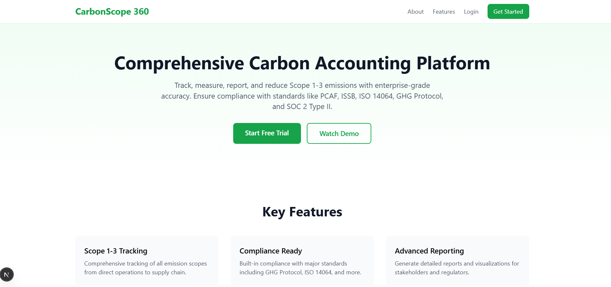

# CarbonScope 360

Comprehensive carbon accounting platform designed for SMEs, corporates, and financial institutions. This platform enables users to track, measure, report, and reduce Scope 1-3 emissions with enterprise-grade accuracy, ensuring compliance with standards like PCAF, ISSB, ISO 14064, GHG Protocol, and SOC 2 Type II.



## Tech Stack

- **Frontend**: Next.js 16, React 19, TypeScript, Tailwind CSS
- **UI Components**: shadcn/ui (New York style)
- **Icons**: Lucide React
- **Backend**: Next.js API Routes
- **Database**: PostgreSQL with Prisma ORM
- **Authentication**: JWT-based authentication
- **Security**: bcryptjs for password hashing
- **Charts**: Recharts
- **Styling**: Tailwind CSS with CSS variables for theming

## Features Implemented

### Week 1

1. Project setup with Next.js and TypeScript
2. Database schema with Prisma (User, Organization, Emission models)
3. Authentication system (Register/Login)
4. Landing page with modern UI
5. API routes for user registration and login
6. User management and organization support in database
7. Basic project structure and folder organization

### Week 2 - Frontend Implementation

1. **shadcn/ui Integration**: Implemented complete design system with New York style components
2. **Dark Mode**: Full dark/light theme support with system preference detection
3. **Authentication UI**:
   - Beautiful login page with card-based design
   - Enhanced registration form with icons and validation
   - Improved UX with loading states and success/error alerts
4. **Dashboard Layout**:
   - Responsive sidebar navigation with mobile menu
   - Top bar with user menu and notifications
   - Clean, modern design with green primary color scheme
5. **Main Dashboard**:
   - Key metrics cards (Total Emissions, Scope 1-3)
   - Interactive emissions trend chart
   - Recent activity feed
   - Quick action buttons
   - Progress indicators and badges
6. **Profile Management**:
   - Personal information editing
   - Security settings (password change)
   - Organization details
   - Tabbed interface for better organization
7. **Navigation Structure**:
   - Sidebar with icons and active states
   - Mobile-responsive with slide-out menu
   - User dropdown menu
   - Theme toggle
8. **Placeholder Pages**:
   - Emissions Data
   - Analytics
   - Reports
   - Team Management
   - Settings
9. **Responsive Design**: Mobile-first approach, tested on all screen sizes
10. **Frontend-Backend Integration**: Existing auth APIs connected to new UI

## Getting Started

### Prerequisites

- Node.js 18+ installed
- PostgreSQL database running locally or remote

### Installation

1. Clone the repository:

```bash
git clone <repository-url>
cd carbonscope
```

2. Install dependencies:

```bash
npm install
```

3. Set up environment variables:

```bash
cp .env.example .env
# Edit .env with your database URL and other configurations
```

4. Set up the database:

```bash
npx prisma migrate dev --name init
npx prisma generate
```

5. Run the development server:

```bash
npm run dev
```

6. Open [http://localhost:3000](http://localhost:3000) in your browser.

## Project Structure

```
carbonscope/
├── app/                    # Next.js app router pages
│   ├── api/               # API routes
│   │   └── auth/         # Authentication endpoints
│   ├── login/            # Login page
│   ├── register/         # Registration page
│   ├── layout.tsx        # Root layout
│   └── page.tsx          # Landing page
├── components/            # Reusable UI components
│   ├── Header.tsx
│   └── Footer.tsx
├── lib/                   # Utility libraries
│   ├── prisma.ts         # Prisma client instance
│   └── auth.ts           # Authentication utilities
├── prisma/                # Database schema and migrations
│   └── schema.prisma
├── types/                 # TypeScript type definitions
└── utils/                 # Helper functions
```

## API Endpoints

### Authentication

- `POST /api/auth/register` - Register a new user
- `POST /api/auth/login` - Login user

## Environment Variables

- `DATABASE_URL` - PostgreSQL connection string or supabase connection
- `JWT_SECRET` - Secret key for JWT tokens
- `NEXTAUTH_URL` - Application URL
- `NEXTAUTH_SECRET` - NextAuth secret key

## Development

- Run development server: `npm run dev`
- Build for production: `npm run build`
- Start production server: `npm start`
- Lint code: `npm run lint`

## Database Schema

### User

- User authentication and profile information
- Role-based access control (USER, ADMIN, SUPER_ADMIN)

### Organization

- Company/organization information
- Links users to their organizations

### Emission

- Carbon emission tracking data
- Supports Scope 1, 2, and 3 emissions
- Includes detailed emission factors and calculations

## Next Steps (Future Milestones)

- Dashboard implementation
- Emission data entry forms
- Reporting and visualization
- Data import/export functionality
- Advanced analytics
- Compliance reporting
- Integration capabilities
